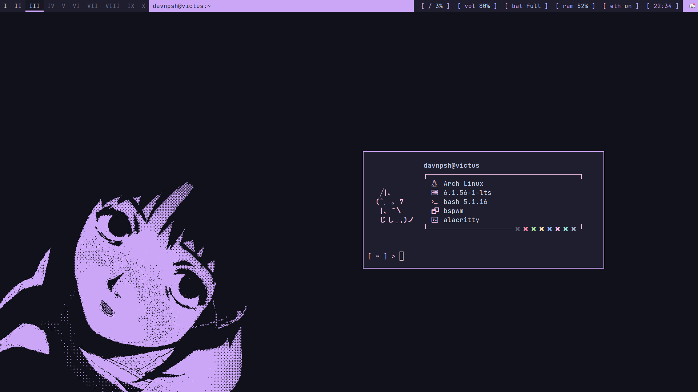

<div align="center">

# davnpsh's desktop dotfiles

A collection of dotfiles and some other configuration files to customize and add functionality to my desktop.

<br>



</div>

<br>

## Table of contents

## Design philosophy
I am not the best at design, but here is my try...


I try to apply, whenever I can, mocha with mauve accent from the [Catppuccin](https://github.com/catppuccin/catppuccin) theme. I really don't use any other colors from the pallete unless I am using a text editor like Neovim.

Also, dark theme is a must. I don't like light backgrounds since they hurt my eyes.

## Dependencies/Software stack

These packages must be installed before moving config files into the system:

* **Window manager:** [bspwm](https://github.com/baskerville/bspwm)
* **Compositor:** [picom](https://github.com/yshui/picom)
* **Hotkey daemon:** [sxhkd](https://github.com/baskerville/sxhkd)
* **Notification daemon:** [dunst](https://github.com/dunst-project/dunst)
* **System info:** [neofetch](https://github.com/dylanaraps/neofetch)
* **Lock screen:** [betterlockscreen](https://github.com/betterlockscreen/betterlockscreen)
* **Bar:** [polybar](https://github.com/polybar/polybar)
* **Terminal:** [alacritty](https://github.com/alacritty/alacritty)
* **Menus:** [rofi](https://github.com/davatorium/rofi)

Since I use Arch Linux:

```bash
doas pacman -S bspwm picom sxhkd dunst neofetch betterlockscreen polybar alacritty rofi
```
