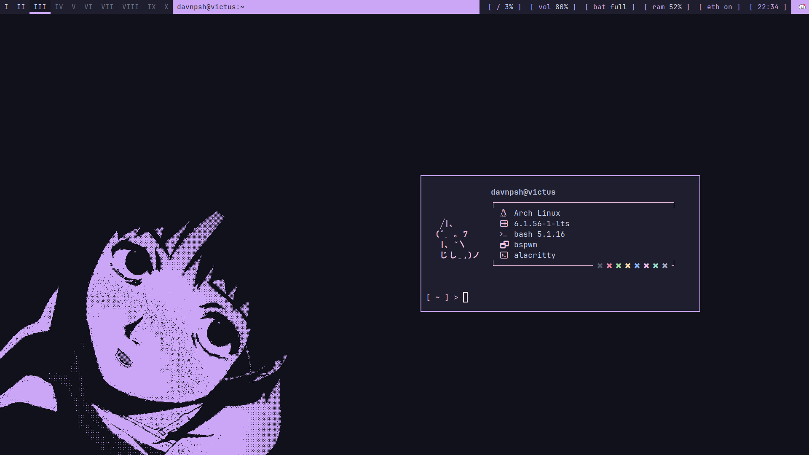

<div align="center">

# davnpsh's desktop dotfiles

A collection of dotfiles and some other configuration files to customize and add functionality to my desktop.

<br>



</div>

<br>

## Table of contents

* [Design philosophy](https://github.com/davnpsh/desktop-dotfiles/#design-philosophy)
* [Installation](https://github.com/davnpsh/desktop-dotfiles/#installation)
    * [Dependencies/Software stack](https://github.com/davnpsh/desktop-dotfiles/#dependenciessoftware-stack)
    * [Other software](https://github.com/davnpsh/desktop-dotfiles/#other-software)
    * [Fonts](https://github.com/davnpsh/desktop-dotfiles/#fonts)
    * [dotfiles](https://github.com/davnpsh/desktop-dotfiles/#dotfiles)


## Design philosophy
I am not the best at design, but here is my try...


I try to apply, whenever I can, mocha with mauve accent from the [Catppuccin](https://github.com/catppuccin/catppuccin) theme. I really don't use any other colors from the pallete unless I am using a text editor like Neovim.

Also, dark theme is a must. I don't like light backgrounds since they hurt my eyes.

## Installation

### Dependencies/Software stack

These packages must be installed before moving config files into the system:

* **Window manager:** [bspwm](https://github.com/baskerville/bspwm)
* **Compositor:** [picom](https://github.com/yshui/picom)
* **Hotkey daemon:** [sxhkd](https://github.com/baskerville/sxhkd)
* **Notification daemon:** [dunst](https://github.com/dunst-project/dunst)
* **System info:** [neofetch](https://github.com/dylanaraps/neofetch)
* **Lock screen:** [betterlockscreen](https://github.com/betterlockscreen/betterlockscreen)
* **Bar:** [polybar](https://github.com/polybar/polybar)
* **Terminal:** [alacritty](https://github.com/alacritty/alacritty)
* **Menus:** [rofi](https://github.com/davatorium/rofi)
* **Display manager:** [lightdm](https://github.com/canonical/lightdm)

Since (btw) I use **Arch Linux**:

```bash
doas pacman -S bspwm picom sxhkd dunst neofetch betterlockscreen polybar alacritty rofi lightdm
```

### Other Software

Other packages can be installed, but in case I find better replacements for it I might consider changing this section.

* **GTK theme:** [catppuccin GTK](https://github.com/catppuccin/gtk)
* **Icons theme:** [papirus](https://github.com/PapirusDevelopmentTeam/papirus-icon-theme)
* **Papirus folder colors:** [catppuccin folders](https://github.com/catppuccin/papirus-folders)
* **File manager:** [thunar](https://docs.xfce.org/xfce/thunar/start)
* **Cursors:** [catppuccin cursors](https://github.com/catppuccin/cursors)
* **GTK theme switcher:** [lxappearance](https://wiki.lxde.org/en/LXAppearance)
* **Display manager theme:** [lightdm-gtk-greeter](https://github.com/Xubuntu/lightdm-gtk-greeter)

In **Arch Linux**:

```bash
doas pacman -S thunar lxappearance-gtk3 lightdm-gtk-greeter \
yay -S catppuccin-gtk-theme-mocha papirus-icon-theme-git papirus-folders-catppuccin-git catppuccin-cursors-mocha
```

### Fonts

I like JetBrains Mono font for every aspect of my desktop.

It is possible to install them manually going to their [website](https://www.jetbrains.com/lp/mono/), but in **Arch Linux** it comes with the patched fonts from nerd fonts library:

```bash
doas pacman -S ttf-jetbrains-mono ttf-jetbrains-mono-nerd
```

### dotfiles

Now, to install the dotfiles in this repo, just clone it in a temporal directory:

```bash
tempdir=$(mktemp -d) \
git clone https://github.com/davnpsh/desktop-dotfiles.git "$tempdir" \
cd "$tempdir" \
```

Then, copy the dotfiles in `./.config/` to `$HOME/.config/`:

```bash
cp -r ./.config/* $HOME/.config/
```

And copy the dotfiles on `./etc/` to `/etc/` (I recommend going through all of them and pasting them manually instead of the following):

```bash
doas cp -r ./etc/* /etc/
```

Finally, remove the tempdir:

```bash
cd && rm -r $tempdir
```

# 

<div align="center">

 [](https://archlinux.org/) [](https://neovim.io/)

</div>
